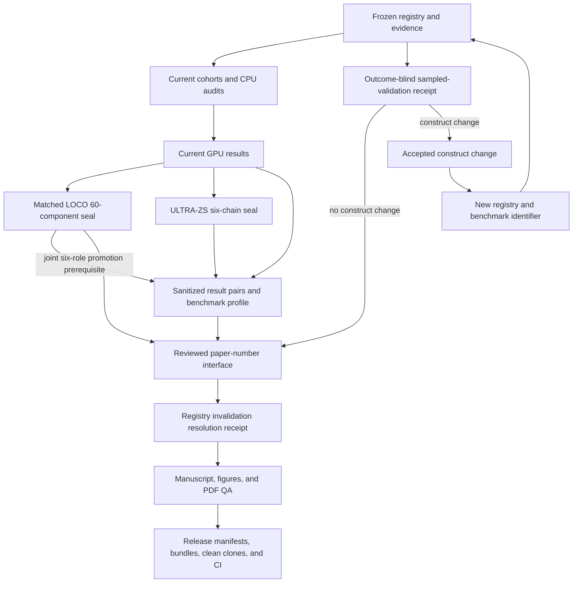

# UpgradeBench v2 replacement and release workflow

This document defines the fail-closed dependency graph for replacing a
registry-dependent result set. It is a gate specification, not a record of
when any particular activity occurred.

## Non-negotiable invariants

1. A frozen formal run is append-only. Configurations, manifests, start
   markers, source files, candidate tables, caches, components, scores, and
   formal receipts are never repaired in place.
2. A command exit code is not a completeness proof. Every controller status
   is parsed and checked for its exact run identifier, freeze hash, expected
   count, valid count, missing count, invalid count, and completion flag.
3. Partial formal results are private operational state. Only a complete,
   live-verified and sanitized aggregate can enter a paper or release
   interface.
4. Existing canonical outputs are never overwritten opportunistically.
   Replacements pass a staged, hash-guarded, rollback-capable transaction.
5. Sampled human registry validation is outcome-blind and independent of result values.
   Release requires a machine-verifiable sampled-validation receipt. An accepted construct
   change invalidates the registry-dependent branch and starts a new benchmark
   version.
6. Public documentation reports validation scope, status, and correction policy.
   It does not infer chronology from the order in which gates are listed here.

## Dependency graph



The benchmark profile consumes current GPU and ULTRA formal receipts. LOCO is
not a semantic profile input, but its current JSON/CSV pair is a transactional
prerequisite because Gate 3 promotes all six canonical roles together. It also
remains a paper-number and release prerequisite.

## Gate 1: matched LOCO finalization

Operational readiness requires all 60 expected component files, all 60
completion receipts, no failure receipt, and all four static-shard end
statuses. Shard end statuses are operational evidence only; a fresh controller
status is the scientific gate.

### Private maintainer finalization

The controller below is intentionally not shipped in the public repository: it contains
private-cluster operational contracts and is available only in the maintainer provenance checkout.
Maintainers run these commands in order against the frozen private formal tree:

```bash
python tools/v2_loco_formal.py status \
  --manifest results_v2/loco_formal/frozen_manifest.json
python tools/v2_loco_formal.py verify \
  --manifest results_v2/loco_formal/frozen_manifest.json
python tools/v2_loco_formal.py summarize \
  --manifest results_v2/loco_formal/frozen_manifest.json \
  --output results_v2/loco_formal/summary.json
python tools/v2_loco_formal.py verify \
  --manifest results_v2/loco_formal/frozen_manifest.json \
  --summary results_v2/loco_formal/summary.json
```

The parsed status must be exactly `60 valid / 0 missing / 0 invalid` with
`complete=true`. `summary.json` is exclusive-create. If it already exists,
skip `summarize` and require `verify --summary`; never delete or replace it.
Publish the final four-field verifier stdout as
`verification_receipt.json` using a same-directory atomic no-clobber create.

The live integration gate is also maintainer-only because it opens the private formal tree:

```bash
python tools/summarize_v2_loco_results.py --check-only
```

### Public aggregate verification

A public or code-only checkout verifies only the sanitized aggregate pair:

```bash
python tools/summarize_v2_loco_results.py --verify-output
```

The first command reopens the frozen controller and rereads all 60 component
files and 120 score files. The saved receipt is an operational log, not the
trust anchor.

## Gate 2: ULTRA-ZS replacement

The fixed-checkpoint protocol has irreversible phases:

```bash
python tools/v2_ultra_formal.py freeze
python tools/v2_ultra_formal.py score-chain --chain sheep --device cuda:0
python tools/v2_ultra_formal.py score-chain --chain cotton --device cuda:0
python tools/v2_ultra_formal.py score-chain --chain aluminium --device cuda:0
python tools/v2_ultra_formal.py score-chain --chain nickel --device cuda:0
python tools/v2_ultra_formal.py score-chain --chain cocoa --device cuda:0
python tools/v2_ultra_formal.py score-chain --chain oilseed-soy --device cuda:0
python tools/v2_ultra_formal.py seal-scores
python tools/v2_ultra_formal.py evaluate
python tools/v2_ultra_formal.py verify --level evaluation
python tools/summarize_v2_ultra_results.py --check-only
python tools/summarize_v2_ultra_results.py --verify-output
```

These commands define the controller phase order; they are not a substitute
for the separately reviewed, hash-pinned formal launcher. The formal launcher
creates the immutable scoring-start marker, binds the runtime and source
inventories, assigns each chain to one fixed slot, and prevents reuse of a
claimed or partial attempt.

Labels remain locked until the complete six-chain score seal. Formal state is
returned without modification and verified before sanitization.

## Gate 3: controlled replacement transaction

LOCO JSON/CSV, ULTRA JSON/CSV, and benchmark-profile JSON/TeX form one fixed
six-role replacement scope. They are promoted together, never as three
independent pair transactions:

1. Generate into a new, empty staging directory.
2. Rebuild LOCO from the canonical verified LOCO formal tree, rebuild ULTRA
   from the sealed ULTRA formal tree, and rebuild the profile from its seven
   formal inputs. Require byte-exact equality with all six staged files; the
   public verifiers are additional checks, not the trust anchors.
3. Record all six staged hashes and all six current canonical hashes.
4. Require the current hashes to equal the explicitly recognized six-member
   expected-before baseline. A missing member, unexpected hash, symlink, hard link, or temporary
   artifact blocks the transaction.
5. Snapshot all six historical members under the persistent private
   transaction namespace.
6. Install all six staged members with a write-ahead journal and byte-exact
   rollback path.
7. Rerun every full rebuild and public verifier. Only then write `PROMOTED`.

The production entry point is the CLI in
`tools/promote_v2_canonical_replacements.py`. `prepare` requires the reviewed
expected-before manifest, canonical LOCO formal tree, ULTRA formal tree, and
all benchmark-profile inputs; it returns the exact plan SHA used by `apply`.
`verify` checks the durable journal and the canonical state. `recover` requires
the before-inventory SHA and restores every old byte. Transaction state is
retained under `private/canonical_replacement_transactions/`, which is never a
release source.

Run `prepare`, `apply`, `verify`, and any recovery on one designated host. The
writer lock includes its host identity and refuses cross-host recovery. On
Windows the transaction guarantees ordinary process-crash recovery; the
formal promotion should run on a filesystem that supports directory `fsync`
when power-loss durability is required.

Never replace only one member. Never use a generator's no-overwrite failure as
authorization to delete a destination. The transaction receipt records old
hashes, staged hashes, installed hashes, complete formal-input inventories,
verifier identities, and final status.

## Gate 4: outcome-blind sampled registry validation

The review instrument contains official HS92 descriptions and the frozen
decision fields, but no trade values, labels, cohort impacts, model scores, or
downstream aggregates. Its decision-record population is the 610-row machine
ledger. The instrument contains the frozen 212-record stratified sample and a
census of all 53 stage definitions; it does not present the remaining 398
decision records as human-reviewed. A release-valid receipt binds the ledger,
sample plan, codebook, registry evidence, reviewer-completed sampled row set,
stage-definition census, adjudication record, and final disposition.

The canonical pre-review freeze is a source-hard-pinned trust anchor. Verify it
before distributing or accepting a completed instrument:

```bash
python tools/registry_human_review_receipt.py --verify-freeze
```

For the canonical single-verdict instrument, the completed workbook remains
private. Prepare a draft only into a new empty
directory strictly below `private/`:

```bash
python tools/prepare_registry_human_review_receipt.py \
  --workbook private/registry_review_instruments/UpgradeBench_HS92_212_Sampled_Outcome_Blind_Human_Validation_COMPLETED.xlsx \
  --output-dir private/registry_review_receipts/r3-candidate \
  --receipt-issued-date YYYY-MM-DD
```

The curator verdict is `Yes`, `No`, or `Uncertain`: `Yes` accepts the machine
proposal, `No` requires a corrected decision/stage and note, and `Uncertain`
records that the permitted evidence is insufficient to decide. When any row is
`No` or `Uncertain`, also supply the canonical private adjudication JSON with
`--adjudication`. If an adjudication accepts a construct change, the command
additionally requires explicit new registry and benchmark identifiers. The parser reads raw OOXML cells, rejects linked/hidden/macro or
external content, verifies the exact 212 sampled decision rows and all 53 stage
rows against the frozen evidence and sample plan, and recomputes completion
without trusting status or summary formula caches.

This command emits only
`registry_human_review_normalized.private.json` and
`registry_human_review_receipt.draft.json`; it cannot write the canonical
receipt. A release custodian inspects the private normalized record, adjudication
partition, construct projection, hashes, and identity-free public draft. This
receipt inspection is not an additional semantic review. Multi-reviewer evidence
must preserve every original verdict separately and bind discussion-based final
adjudication; the current protocol and receipt record two reviewers and no
accepted construct change. Then
validate and explicitly promote the inspected draft with exclusive-create
semantics:

```bash
python tools/registry_human_review_receipt.py \
  --verify-public \
  --receipt private/registry_review_receipts/r3-candidate/registry_human_review_receipt.draft.json
python tools/registry_human_review_receipt.py \
  --promote-reviewed-draft \
  --receipt private/registry_review_receipts/r3-candidate/registry_human_review_receipt.draft.json \
  --confirm PROMOTE-REGISTRY-HUMAN-REVIEW-RECEIPT
```

Finally update the curation protocol to its sampled-complete, exact-receipt-bound
state and run `--verify-release`. Neither draft preparation nor receipt
promotion can make a pending or construct-changing protocol release-eligible.

The disposition has three branches:

- **No accepted construct change.** Retain current computations and add the
  completed sampled-validation receipt.
- **Documentation-only clarification.** Retain computations; refresh the
  receipt, documentation, and manifests.
- **Accepted construct change.** Assign a new registry and benchmark
  identifier, then rebuild from the registry-dependent boundary:

  `registry -> BACI cache -> cohorts -> audits/CPU -> GBDT/product-space/robustness -> GPU -> LOCO -> ULTRA -> profile -> paper -> release`.

An accepted construct change includes a code decision, stage membership or
assignment, stage definition, or semantic `upstream`, `upstream_map`,
`derived_from`, `derived_from_hs`, `produces`, `form_of`, or `named_sources`
change. Release smoke and manifest verification must reject a missing,
pending, partial, stale, or construct-changing receipt.

## Gate 5: benchmark profile and paper interface

Build the profile into staging from current GPU and ULTRA receipts, review the
candidate bytes, promote them through Gate 3, then verify both profiles:

```bash
python tools/generate_v2_benchmark_profile.py --verify --profile repository
python tools/generate_v2_benchmark_profile.py --verify --profile full
```

Before resolving the active registry hold, rerun every current scientific
verifier, including registry/evidence, cohorts, raw-label audit, B1 coverage,
CPU baselines, GBDT, product-space, robustness, GPU, value diagnostics, LOCO,
ULTRA, and the benchmark profile.

Generate the schema-8 paper interface into a non-canonical review directory:

```bash
python tools/resolve_v2_invalidation.py \
  --preview-dir tmp/schema8-current-review
```

Review its complete source map, macro count, key digest, value digest, JSON,
and TeX. Update the frozen contract only from those reviewed bytes. Then run:

```bash
python tools/resolve_v2_invalidation.py --dry-run
python tools/resolve_v2_invalidation.py \
  --confirm RESOLVE-V2-REGISTRY-AUDIT
python tools/resolve_v2_invalidation.py \
  --verify-public-receipt --profile repository
python tools/resolve_v2_invalidation.py \
  --verify-public-receipt --profile full
python tools/resolve_v2_invalidation.py --verify-resolved
python tools/generate_v2_paper_numbers.py --verify
```

The invalidation marker is promoted last. A preview or failed dry run cannot
alter canonical paper bytes.

After every result pair, the profile, and the paper-number JSON/TeX interface
are current, run the independent read-only interface alignment gate:

```bash
python tools/verify_v2_number_alignment.py \
  --mode interface --profile repository
python tools/verify_v2_number_alignment.py \
  --mode interface --profile full
```

This gate reruns the canonical LOCO/ULTRA/profile/registry/paper verifiers and
then checks their joins. In particular, profile task counts and per-chain HS6
counts must equal the paper macros; paper JSON, generated TeX, and source
hashes must agree byte-for-byte; both paper wrappers must import each
interface exactly once; and governed hard-coded registry counts in the active
manuscript must match the audited ledger. Undefined or shadowed generated
macros also fail. The command is verification-only and never regenerates or
edits an artifact.

## Gate 6: manuscript and release sealing

Regenerate figures only from the verified paper interface, replace any
historical layout/status prose, rerun the number-alignment gate, rebuild both
paper wrappers, and inspect every page. Recheck all qualitative direction
statements against the new interface; historical tests or prose are not
evidence for the replacement result. Rerun both alignment profiles after the
final manuscript edit and before release sealing.

```bash
python tools/verify_v2_number_alignment.py \
  --mode release --profile repository
python tools/verify_v2_number_alignment.py \
  --mode release --profile full
```

Release mode additionally requires the release-eligible human-review and
invalidation receipts and rejects stale/pending manuscript status language.
It also rejects unfinished replacement/review claims in `README.md`,
`results_v2/README.md`, `results_v2/CLAIM_LEDGER.md`, and
`docs/REGISTRY_REVIEW_CODEBOOK.md`, including pending claim-ledger rows or
unchecked release items.

Release sealing follows this order:

1. Full unit and scientific-verifier suite.
2. Package manifest generation and verification.
3. Artifact index generation and verification.
4. Release manifest generation and verification.
5. Public audit and repository/full release smoke.
6. Bundle build and archive verification in a new empty directory.
7. Repository/full clean-clone checks on supported operating systems.
8. Remote CI, signed tag, release assets, and DOI/archival metadata.

Any changed byte after a seal reopens every downstream seal. No release is
complete while the registry hold is active, a result pair is historical or
one-sided, the sampled human-validation receipt is absent, or any clean-clone/CI gate is
pending.
